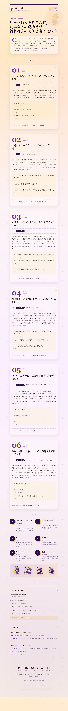

# group-daily（WaytoAGI-EDU）

> 阿里云百炼 CLI Workshop 提交作品：用 `bl text chat` + Agent Skill，把教育社群的手动群聊素材生成 `story.json`，再渲染成 WaytoAGI-EDU 风格的 HTML + PNG 群日报。

## ✦ Workshop 提交摘要

| 项目 | 内容 |
|---|---|
| GitHub 仓库 | https://github.com/Elianyang/group-daily-waytoagi-edu |
| 作品类型 | Agent Skill + 百炼 CLI + 本地渲染脚本 |
| 使用的百炼 CLI 能力 | `bl text chat`：把手动群聊素材结构化为 `story.json` |
| 核心产出 | 教育社群故事化日报 HTML + PNG 长图 |
| 提交稿 | [`WORKSHOP_SUBMISSION.md`](./WORKSHOP_SUBMISSION.md) |

### 彩排验证状态

- `python3 scripts/check_env.py`：通过，公开版低风险离线流程就绪。
- `python3 scripts/make_daily.py --story examples/story_waytoagi_edu_demo.json --out-dir output --name-suffix _smoke --no-open`：通过，已生成示例 HTML + PNG。
- 输出样例尺寸：`900×4998`，约 `2MB`。
- `scripts/generate_story_with_bl.py`：代码链路已接入 `bl text chat`；运行时需要百炼账号/API Key 处于正常可用状态。

### 一句话介绍

`group-daily（WaytoAGI-EDU）` 是一个面向教育 AI 共创社群的群日报生成器：它不把聊天压成会议纪要，而是把当天的好问题、好观点、好资源和共创瞬间，整理成一份有角色、有情绪、有品牌识别的故事化长图。

### 百炼 CLI 在这里做什么

公开版默认不读取微信数据库，也不上传原始聊天记录。用户把自己有权处理的素材放到 `input/` 后，可以运行：

```bash
python3 scripts/generate_story_with_bl.py \
  --chat input/chat_manual_demo.txt \
  --out output/story.json \
  --group "WaytoAGI-EDU 情报局" \
  --date 2026-06-11 \
  --time-range "09:18 → 20:10"
```

脚本会调用：

```bash
bl text chat --messages-file <tmp.json> --output text --non-interactive
```

生成符合 [`references/story-schema.md`](./references/story-schema.md) 的 `story.json`，再交给 `scripts/make_daily.py` 渲染。

### 效果预览



---


## ✦ 公开使用说明

这个仓库会以 **Public / 公开仓库** 发布。别人可以直接 clone / fork 后使用教育版群日报 Skill，但需要注意：

- ✅ 可以复制代码、模板、README 和示例结构，用于自己的社群日报。
- ✅ 可以参考 WaytoAGI-EDU 教育版的视觉方向：可爱、手绘、紫金配色、温暖叙事。
- ✅ 可以使用仓库内的示例图片理解版式效果。
- ⚠️ 如需在自己的公开项目中继续使用「WaytoAGI-EDU」「进击中的丫丫老师」署名、教育版 logo、小鹿吉祥物或表情包，请保留来源说明，不要冒充官方身份。
- ❌ 不包含任何微信群原始聊天记录、数据库、缓存或个人隐私数据。
- ❌ 不建议使用任何可能触发平台风控的微信数据库读取、解密、自动刷新能力作为默认生产流程。

推荐方式是：用户把自己有权处理的群聊素材手动整理到 `input/`，再用 Skill 生成 HTML + PNG。这样别人复制仓库后也可以跑通自己的日报，而不会依赖我们的本地微信环境。

WaytoAGI-EDU 专属群日报技能：把微信群聊素材转化为可阅读、可传播、可沉淀的「故事化群报」HTML + PNG 长图。教育版内置紫金魔法小鹿吉祥物、16 张小鹿表情贴纸、WaytoAGI-EDU 配色，并在每份日报底部自动加入隐约署名 `Co-Created with 进击中的丫丫老师`。

> 它不是普通会议纪要，而是一种面向教育 AI 共创社群的内容产品：把一天的讨论，整理成有情绪、有角色、有主题、有传播感的社群日报。

---

## ✦ 作者、共创者与版本演进

这个仓库是一个教育场景定制版 Skill。为了尊重原始工作与二次共创，这里把三次迭代关系说清楚。

### 原作者 / 上游来源

- **原始项目来源**：[`Larkin0302/vantasma-toolkit`](https://github.com/Larkin0302/vantasma-toolkit)
- **原始作者**：GitHub 用户 **Larkin0302**
- **原始能力**：围绕微信群数据读取、群日报生成、HTML/PNG 输出等能力构建的 `group-daily` Skill / toolkit。

> 本仓库是在原始 `group-daily` 思路和工具链基础上，为 WaytoAGI-EDU 教育社群做的本地化、品牌化与安全化改造。原始工程能力与底层思路应归功于上游作者 Larkin0302。

### 共创者 / 教育版发起人

- **教育版发起与产品共创**：**进击中的丫丫老师**
- **社群场景**：`WaytoAGI-EDU 情报局`
- **定位**：面向教师、教育创新者、AI 教育实践者的社群日报与知识沉淀工具。

进击中的丫丫老师不是单纯“使用者”，而是这个教育版的产品共创者：她提出了教育社群的内容气质、视觉偏好、可爱手绘风格、小鹿吉祥物、署名方式、品牌大小写规范，以及“群日报不只是总结，而是教育社群共同记忆”的方向。

### 1.0：原版 group-daily

- **主要作者**：Larkin0302 / 原始 `vantasma-toolkit`
- **核心能力**：把微信群一段时间的聊天记录生成故事化群日报。
- **主要形态**：偏通用群日报，强调“不是会议纪要，而是短篇报道”。
- **输出结果**：HTML + PNG 长图，适合转发、保存和二次传播。

1.0 解决的是“微信群聊信息太散，如何变成可读内容产品”的问题。

### 2.0：WaytoAGI-EDU 教育版

- **共创者**：进击中的丫丫老师 + AI 助手
- **基于**：原始 `group-daily` 1.0
- **服务对象**：WaytoAGI-EDU 教育 AI 共创社群
- **核心变化**：从“通用群日报”升级为“教育社群品牌日报”。

2.0 加入了教育版元素：

- WaytoAGI-EDU 专属紫金配色；
- 魔法小鹿吉祥物与 16 张小鹿贴纸；
- 更可爱、手绘、亲和的字体气质；
- `Co-Created with 进击中的丫丫老师` 固定署名；
- 更适合教师、学生、教育创新者阅读的叙事结构；
- 对 `WaytoAGI-EDU` 品牌大小写的硬约束；
- 避免过度商务化、古板化的视觉表达；
- 加入低风险离线素材模式，避免默认依赖微信数据库读取。

2.0 解决的是“教育社群的日报不应该只是技术摘要，而应该有温度、有陪伴感、有社群身份”的问题。

### 3.0：规划中的社群记忆与互动版（尚未完全完成）

3.0 是我们想继续推进、但还没有完全完成的方向。它不应被理解为当前稳定生产能力，而是路线图 / 实验方向。

设想中的 3.0 包括：

- **群成员历史画像**：在合规、授权和低风险前提下，查看某位群成员过去的代表性发言、关注主题、常见贡献类型。
- **群友卡片**：为成员生成“这个人常聊什么 / 擅长什么 / 适合向 Ta 请教什么”的社群名片。
- **跨天记忆**：不只总结今天，而是能关联“这个问题上周谁也提过”“这个资源之前出现过几次”。
- **互动 Dashboard**：从静态长图升级为可点击、可筛选、可按主题/人物/资源浏览的本地网页。
- **教育知识库沉淀**：把群聊中有长期价值的提问、案例、工具、课程实践沉淀成可检索素材。

但因为微信账号安全、平台规则、隐私保护和数据授权都非常重要，3.0 不会默认采用高风险的自动抓取方式。未来更理想的实现方式是：

- 用户主动导出的聊天素材；
- 群成员自愿提交内容；
- 明确授权的社群知识库；
- 本地离线处理；
- 不上传原始聊天记录；
- 不默认读取微信运行时数据库。

> 简单说：1.0 是“能生成群日报”；2.0 是“生成 WaytoAGI-EDU 教育版群日报”；3.0 想成为“教育社群记忆与群友知识网络”，但必须在安全、合规、授权的前提下慢慢完成。

---


## ✦ 快速开始：别人 clone 后怎么用

```bash
git clone https://github.com/Elianyang/group-daily-waytoagi-edu.git
cd group-daily-waytoagi-edu
bash install.sh
python3 scripts/check_env.py
```

### 路径 A：不用百炼 CLI，直接渲染示例 story

你可以先复制仓库内的示例：

```bash
mkdir -p output
cp examples/story_waytoagi_edu_demo.json output/story.json
```

真实使用时，把 `output/story.json` 里的示例群名、故事线、高光人物、Q&A 和金句替换为你自己有权处理的群聊素材。公开版推荐的数据入口是：

```text
input/
├── chat_manual_YYYY-MM-DD.txt      # 手动复制/整理的群聊文本，可用于辅助生成 story.json
├── member_submissions.md           # 群成员主动提交的今日好问题、好资源、金句
└── screenshots/                    # 可选：少量截图素材，后续可 OCR 后再写入 story.json
```

生成日报的真实命令：

```bash
python3 scripts/make_daily.py \
  --story output/story.json \
  --out-dir output \
  --name-suffix _demo \
  --no-open
```

脚本会基于 `story.json` 生成 HTML，并尝试导出 PNG。若你的环境暂时没有可用浏览器截图能力，也可以先只查看 HTML，再用浏览器或截图工具导出 PNG。

### 路径 B：使用百炼 CLI，从手动群聊素材生成 story

先安装并登录阿里云百炼 CLI：

```bash
npm install -g bailian-cli
bl auth login --api-key sk-xxxxx
bl text chat --message "请只回复 OK"
```

如果 `bl` 返回 `HTTP 400 (Arrearage)`，说明当前百炼账号额度/账单状态不可用；请到百炼控制台确认额度，或切换可用的 `DASHSCOPE_API_KEY`。

然后用公开示例素材生成 `story.json`：

```bash
python3 scripts/generate_story_with_bl.py \
  --chat input/chat_manual_demo.txt \
  --out output/story.json \
  --group "WaytoAGI-EDU 情报局" \
  --date 2026-06-11 \
  --time-range "09:18 → 20:10"
```

再渲染 HTML + PNG：

```bash
python3 scripts/make_daily.py \
  --story output/story.json \
  --out-dir output \
  --name-suffix _workshop \
  --no-open
```

这条链路对应 Workshop 的提交重点：

- `bl text chat` 负责把素材整理成结构化日报数据；
- `SKILL.md` 和 `references/` 负责约束叙事风格、品牌规范和字段契约；
- `make_daily.py` 负责本地生成可分享的 HTML + PNG。

## ✦ 图片模板与教育版素材

仓库已包含教育版素材和两张经过确认的图片模板，方便别人 clone 后直接查看风格基准：

```text
assets/
├── examples/
│   ├── waytoagi-edu-daily-v5-confirmed.png       # 第一轮确认过的教育版日报长图模板
│   └── waytoagi-edu-daily-style-confirmed.png    # 后续新风格确认版日报长图模板
└── waytoagi-edu/
    ├── mascot_logo.png
    ├── mascot_hero.png
    ├── mascot_full.png
    ├── sticker_01.png ... sticker_16.png
    └── sticker_sheet.png
```

这些素材用于说明 2.0 教育版的视觉系统：

- **主视觉**：紫金魔法感 + 教育 AI 社群气质；
- **字体气质**：避免古板商务风，偏手绘、圆润、亲和；
- **叙事风格**：把聊天内容写成有角色、有情绪、有重点的社群日报；
- **品牌规范**：统一使用 `WaytoAGI-EDU`，注意大小写和连字符；
- **署名规范**：默认保留 `Co-Created with 进击中的丫丫老师`。

> 注意：示例图片只展示排版和风格，不应被理解为包含可复用的真实聊天数据源。公开仓库不会上传原始聊天记录。

## ✦ 当前推荐使用方式：低风险离线素材模式

由于微信账号存在平台风控与隐私安全边界，本教育版现在推荐使用低风险模式：

1. 用户手动复制当天值得进入日报的聊天内容；
2. 或由群成员主动提交“今日好问题 / 今日好观点 / 今日好资源 / 今日金句”；
3. 或把少量截图放入本地文件夹做 OCR；
4. Skill 只处理这些用户主动提供的素材，生成 HTML + PNG 日报。

默认不建议在生产环境中继续使用自动读取、解密、刷新微信本地数据库的方式。相关能力可以作为历史技术路线或实验记录存在，但不应作为教育版默认工作流。

对公开使用者来说，这意味着：**复制本仓库即可复用模板、脚本和视觉体系；但数据入口应替换为你自己合法拥有和主动提供的素材。**

---

# group-daily

> 把一个微信群一段时间的对话，做成杂志风的「故事化群报」HTML + PNG 长图。
> 不是会议纪要，是一篇短篇报道。

一个 Claude Code Skill，用 Spotify Wrapped / 网易云年报那种「故事化年报」的范式，给你的微信群每天/每周/每月做一份能截图发朋友圈的杂志风内容产品。

---

## ✦ 为什么做这个

市面上的「微信群智能纪要」工具有一个共同的问题：**信息保存了，但价值传不出去**。

把一群人聊了一天的内容压成一份 bullet-point 清单，技术上是「智能化」了，但读起来像会议纪要——没人想转发，也没人想保存。

故事化年报这种产品形态（Spotify Wrapped、网易云年报、Stripe Annual Letter）告诉我们另一条路：

> 数据是起点，故事是终点。<br>
> 可分享性是一切的前置条件。<br>
> 不同的用户群需要不同的格式。

这个 skill 是把这套思路套在「群日报」这个新场景上的一次实践。设计依据基于《群日报形态横纵分析报告》——做了 QFD 质量屋打分 + Spotify Wrapped / 网易云年报 / Stripe Letter / 飞书智能纪要 等横向对比。

跑出来的样子（部分截图）：

```
┌──────────────────────────────────────┐
│ 群日报                  Vol. 2026.05.11 │
│                                       │
│ 二十天，                              │
│ 从一条「1」                           │
│ 到 Claude 解密微信。                  │
│                                       │
│ 「这群早在 3 月 23 日就开了，第一条… │
│ ─────────────────────────────────────│
│                                       │
│  01    ── 09:20 ─────────────         │
│                                       │
│  提问者                               │
│                                       │
│  一个问题，                           │
│  点燃整个上午                         │
│                                       │
│  CAST · [示例联系人A头像]                  │
│                                       │
│  「示例联系人A抛了一个看似普通的问题……」  │
│                                       │
│  「整理知识库的员工，不一定愿意…」   │
│                              — 示例联系人B  │
│                                       │
│  PRODUCED · 万涂幻象开源 wiki + …    │
└──────────────────────────────────────┘
```

---

## ✦ 微信数据是怎么来的（重点）

这是这个项目最特别也最敏感的部分，单独写一节。

### 1. 数据在哪里

macOS 桌面版微信 4.x 把消息、联系人、群成员、头像、语音、图片这些数据全部存在本地，路径在：

```
~/Library/Containers/com.tencent.xinWeChat/Data/Documents/xwechat_files/
├── <wxid>_<random>/                  # 当前登录用户
│   ├── msg/                          # 消息附件
│   ├── db_storage/
│   │   ├── message/message_N.db      # 聊天记录（SQLCipher 加密）
│   │   ├── contact/contact.db        # 联系人/群成员（SQLCipher 加密）
│   │   ├── head_image/head_image.db  # 头像（SQLCipher 加密）
│   │   └── ...
│   └── temp/head_image/              # 头像缓存（明文 jpg，但文件名是 hash）
└── all_users/
    └── head_imgs/                    # 全局头像（明文 jpg）
```

iOS / Android 不在范围内，本 skill 仅支持 macOS。

### 2. 为什么要"解密"

微信用 SQLCipher 给上面这些 db 文件加了密，直接拿 `sqlite3 contact.db` 会报 `file is not a database`。要正常读取，需要：

1. **拿到解密 key**：从运行中的微信进程内存里找到（每个登录用户的 key 不同）
2. **用 key 解密整库**：把加密的 db 解成普通的 SQLite db（落到一个新目录）
3. **读取解密后的库**：之后就是标准 SQL 操作

这一步社区有几个成熟方案：

| 方案 | 平台 | 状态 | 备注 |
|---|---|---|---|
| [PyWxDump](https://github.com/xaoyaoo/PyWxDump) | macOS / Windows | 开源 | 老牌方案，覆盖广 |
| [WeChatMsg / 留痕](https://github.com/LC044/WeChatMsg) | Windows 主 | 开源 | 桌面客户端 + 导出 |
| [wxhelper](https://github.com/ttttupup/wxhelper) | Windows | 开源 | DLL 注入路线 |
| [wechat-dump-rs](https://github.com/0xlane/wechat-dump-rs) | macOS / Windows | 开源 | Rust 重写版 |
| `wechat-decrypt`（本作者私有项目）| macOS | **未公开** | 集成了 `vchat` CLI + `mcp_server` |

本 skill 默认依赖最后一个（`wechat-decrypt`），因为开发它的作者就是 skill 的作者。**如果你没有这个项目，按下面"无 wechat-decrypt 怎么办"的指引走 PyWxDump 等替代方案，效果一致**。

### 3. 三条数据访问路径

skill 实际跑的时候，按以下优先级使用：

```
[A] vchat CLI (推荐)
       ↓ 失败/没装
[B] wechat MCP server
       ↓ 失败/没装
[C] 直接读 sqlite 解密产物
```

**A. `vchat` CLI（推荐路径，最稳）**

`vchat` 是 `wechat-decrypt` 项目里附带的命令行工具，封装了一站式微信本地数据访问能力。skill 主要用它的这几个命令：

```bash
vchat history "<群名>" -n 5000 --asc > log.txt   # 拉聊天记录
vchat voice-ls "<群名>"                           # 列语音
vchat voice-transcribe "<群名>" --local-id N      # 转写单条
vchat contacts "<显示名>"                         # 找单人 wxid
vchat avatar "<名/wxid>" -o <dir>                # 导出头像
vchat stats-overview / voice stats                # 数据洞察
```

优点：自带 venv 装好 `openai-whisper` + `silk-python`，零外部依赖；拉大量历史直接落盘不爆 token。

**B. `wechat` MCP server（兜底）**

如果运行机器配置了 wechat MCP server（Claude Code MCP 集成），skill 可以调用 MCP 工具替代 CLI：

```
mcp__wechat__get_chat_history
mcp__wechat__get_voice_messages
mcp__wechat__decode_voice
mcp__wechat__transcribe_voice
mcp__wechat__get_contacts
mcp__wechat__decode_image
```

这套 MCP 工具源自 `wechat-decrypt` 项目里的 `mcp_server.py`。开源后会公开仓库和注册方法。

**C. 直接读 sqlite（fallback 的 fallback）**

skill 自带的 `lookup_members.py` 和 `extract_avatars.py` 会直接读解密后的 `contact.db` 和 `head_image.db`。表结构见 `references/data-sources.md`。

只要你的解密产物路径符合下面这个结构（通过 `VCHAT_DATA_DIR` 环境变量指定根目录），脚本就能跑：

```
$VCHAT_DATA_DIR/
└── decrypted/
    ├── contact/contact.db
    └── head_image/head_image.db
```

如果你用 PyWxDump 之类的替代方案，把解密产物 link 到这个路径即可。

### 4. 无 wechat-decrypt 怎么办

如果你没有作者的 `wechat-decrypt` 项目（目前未公开），仍然可以让 skill 跑起来，按以下步骤：

```bash
# 1. 装一个开源解密工具（推荐 PyWxDump，覆盖 macOS）
git clone https://github.com/xaoyaoo/PyWxDump.git
cd PyWxDump && pip install -e .

# 2. 跑解密，拿到 contact.db / head_image.db
#    （具体命令看 PyWxDump 的 README）

# 3. 把解密产物放到 skill 期待的路径
mkdir -p ~/wechat-decrypted/decrypted/{contact,head_image}
cp <PyWxDump 输出>/contact.db ~/wechat-decrypted/decrypted/contact/
cp <PyWxDump 输出>/head_image.db ~/wechat-decrypted/decrypted/head_image/

# 4. 告诉 skill 这个路径
export VCHAT_DATA_DIR=~/wechat-decrypted
```

此时 `lookup_members.py` 和 `extract_avatars.py` 能跑；`vchat history` 和 `vchat voice-transcribe` 不可用，但 skill 会自动降级到 MCP 兜底路径（前提是你装了 wechat MCP server）。

### 5. 隐私承诺

- 这个 skill **不上传任何数据到任何服务器**，所有处理都在本地
- skill 仓库本身**不包含**任何聊天记录、头像、群名、个人信息
- 作者自己用过的 styles / story.json 历史档案存在 Vault 里，**不在 skill 仓库**，不会随 git push 出去
- whisper 语音转写也是**本地模型**（base 模型约 145MB，首次自动下载到 `~/.cache/whisper/`）
- 用作者私有的 `vchat` CLI 时，所有命令都是只读访问本地 sqlite

把这个 skill 分享 / 开源给别人时，对方下载到的是工作流脚本和模板，**接触不到分享者的任何微信数据**。每个用户跑起来读的是自己机器上的微信。

### 6. 合规提示

- 这个 skill 只读取**当前登录用户自己**的微信本地数据
- 不要用它读取不属于你的微信账号的数据
- 商业用途请评估当地隐私法规

---

## ✦ 安装

### 1. 装 skill

```bash
git clone https://github.com/<owner>/group-daily.git ~/.claude/skills/group-daily
# 或下载 release tarball 解压到 ~/.claude/skills/group-daily/
```

### 2. 一键装依赖 + 自检

```bash
bash ~/.claude/skills/group-daily/install.sh
```

脚本会：

- 装 Python 依赖（Pillow、openai-whisper、silk-python）
- 跑 6 项环境自检（macOS、Python 包、vchat、wechat-decrypt 路径、Chrome、环境变量）
- 给每个缺失项打印修复建议

### 3. 配环境变量（可选）

```bash
# 群日报数据根目录（styles + story.json 归档存放处）
# 默认: ~/Documents/GroupDaily
export GROUP_DAILY_VAULT=~/Documents/GroupDaily

# wechat-decrypt（或其他解密工具）的根目录
# 默认: ~/Projects/wechat-decrypt
export VCHAT_DATA_DIR=~/Projects/wechat-decrypt
```

写到 `~/.zshrc` 或 `~/.bash_profile` 持久化。

---

## ✦ 使用

在 Claude Code 里说：

> 给「XX 群」做个群日报

或：

> XX 群今天聊了什么，做个日报

skill 自动触发，按 8 步流程跑：

| Step | 干什么 |
|---|---|
| 1 | 拉聊天记录（`vchat history -n N --asc` 落盘，或 MCP 兜底） |
| 1.5 | 检查语音 + 批量转写（如有） |
| 2 | 基础统计（消息数、发言人、字数） |
| 2.5 | 加载群风格指纹（已沉淀过的群） |
| 3 | 阅读消息提炼故事（6-8 段时间故事线 + 高光人物 + SOP + Q&A） |
| 4 | 查群成员 wxid |
| 5 | 写 story.json |
| 6 | 跑 make_daily.py 生成 HTML + PNG 长图 |
| 7.5 | 更新群风格指纹 |
| 8 | 归档 story.json 到 `$GROUP_DAILY_VAULT/<日期>_<群名>.json` |

输出在 `~/Desktop/`，自动打开 HTML 和 PNG。

---

## ✦ 设计哲学

详见 `references/design-principles.md`：

1. **时间故事线是骨架**（QFD 矩阵打分 200，所有特征里最高）
2. **砍掉冗余**：24h 曲线 / 话题分布 / TOP N 排行 / 全员标签册 / Dashboard 都是反模式
3. **杂志风去 AI 化**：衬线字体 + 米黄底 + 朱砂红 + 大编号 + 留白
4. **干货默认 details open**：保证 PNG 截图能看到完整内容
5. **只沉淀群文化，不沉淀人物档案**：群文化稳定（黑话/调性），人物动态（每次临时分析）

---

## ✦ 目录结构

```
group-daily/
├── README.md                     ← 本文件
├── LICENSE                       ← MIT
├── SKILL.md                      ← Claude Code skill 主入口（8 步工作流）
├── install.sh                    ← 一键装依赖 + 自检
├── .gitignore
├── scripts/
│   ├── check_env.py             ← 环境自检（6 项）
│   ├── lookup_members.py        ← 查群成员 wxid 映射
│   ├── extract_avatars.py       ← 导出头像为 base64
│   ├── transcribe_voices.py     ← 批量转写语音（系统 whisper CLI 兜底）
│   ├── render_html.py           ← 渲染杂志风 HTML
│   ├── html_to_png.py           ← HTML → PNG 长图（Chrome headless + Pillow 裁底）
│   ├── make_daily.py            ← 主编排
│   └── context_helper.py        ← 群风格指纹目录助手
├── references/
│   ├── design-principles.md     ← QFD 设计准则
│   ├── writing-style.md         ← 故事化写作风格
│   ├── story-schema.md          ← story.json 字段定义
│   ├── data-sources.md          ← 微信数据源说明
│   ├── group-style.md           ← 群风格指纹结构
│   └── vchat-cli.md            ← vchat CLI 速查
└── assets/
    └── template.html            ← 杂志风 HTML 模板
```

---

## ✦ 路线图

- [x] v1：发言量/时段 dashboard 版（已弃，「太 AI 味」）
- [x] v2：杂志风时间故事线 + 真实头像
- [x] v2.1：语音消息接入
- [x] v2.2：CLI 优先，MCP 兜底
- [x] v2.3：路径环境变量化，可分享版
- [ ] v3：模板可换肤（杂志风之外的极简风/科技风）
- [ ] v3：跨群「群史专辑」一键生成
- [ ] v3：群风格指纹的演化追踪（每次更新生成 diff）
- [ ] 等待 `wechat-decrypt` 开源后补充安装指引

---

## ✦ 致谢

- 设计方法论：赤尾洋二 1972 年提出的 QFD（质量屋）
- 写作风格参考：Spotify Wrapped、网易云年度报告、Stripe Annual Letter、Stratechery（Ben Thompson）
- 字体回退链：macOS 自带的 Songti SC / STSong（无网络也能显示衬线效果）
- 语音转写：OpenAI Whisper（base 模型）
- SILK 解码：[silk-python](https://github.com/CarlGao4/silk-python)
- 启发：横纵分析法（融合 Saussure 历时-共时 + 社会科学 longitudinal-cross-sectional + 商学院案例研究）

---

## ✦ License

MIT。见 `LICENSE`。

---

## ✦ FAQ

**Q：为什么不支持 Windows / Linux？**
A：微信桌面数据库的路径、解密 key 提取方式、whisper / silk-python 在不同平台的安装方式都不一样。当前作者只用 macOS，没有跨平台测试条件。欢迎 PR。

**Q：能不能给企业微信 / 钉钉 / 飞书做？**
A：飞书有官方 OpenAPI，技术上可行但风格完全不同。本项目专注微信群这种「非结构化口语对话」场景。

**Q：转写出来的语音是繁体？**
A：whisper 中文模型默认偏繁体输出。skill 的 writing-style 里写了：AI 引用语音转写时按上下文转简体并修订错字。

**Q：群里太多，怎么知道哪个值得做日报？**
A：跑 `vchat stats-top-groups -n 20` 看最活跃的群。也可以跑 `vchat voice-stats` 看哪些群语音密度高。

**Q：能不能不在 Claude Code 里跑，用脚本一次性出图？**
A：当前的「故事提炼」环节强依赖 LLM 来读消息、写叙事。如果想完全脚本化，可以接 Claude API 或本地 LLM，但需要改 make_daily.py 增加 LLM 调用。这是 v4 的方向。

## ✦ 进阶互动版：每日总结 / 我的群友 / 聊天记录

除了生成适合转发的 PNG 长图，本专属版还支持生成一个纯本地互动 Dashboard，形态参考“每日总结 + 我的群友 + 聊天记录”的群知识库：

- **每日总结**：查看当天故事线、SOP、Q&A 和数据摘要。
- **我的群友**：点击正文中的蓝色人名，跳到群友卡片；可搜索成员、角色和自我介绍。
- **聊天记录**：按发言人分组查看当天发言，适合追某位群友的上下文。

```bash
python3 scripts/make_daily.py \
  --story story.json \
  --chat-log chat_history.txt \
  --site \
  --out-dir ./out \
  --name-suffix _interactive \
  --no-open
```

详见 `references/interactive-dashboard.md`。
